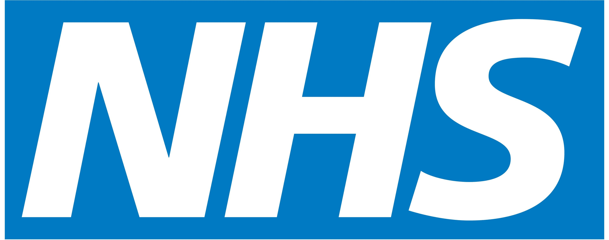

# EQUALITY & INCLUSION MANAGER

  

  
    <h2 class="persona-name">Caroline Ahmed</h2>
    
Equality & Inclusion Manager (Patient Experience Lead)

    

      

        <h4>Professional Data</h4>
        

          
👤5 years in EDI and patient experience roles

          
📍NHS Trust - Patient Experience

          
💼Patient Experience / EDI

        

      

      

        <h4>Role & Background</h4>
        <ul>
          <li>I transitioned from speech and language therapy into EDI work to improve access for vulnerable groups.</li>
          <li>I’m multilingual (Urdu, Punjabi) and deeply involved in community outreach.</li>
          <li>I manage patient feedback, complaints related to communication, and AIS compliance.</li>
          <li>I coordinate culturally appropriate resources and staff training on communication needs</li>
        </ul>
      

    

  

  

    
     
    
  

  
  

    <h3 class="section-title">Goals & Desired Outcomes</h3>
    <ul>
          <li>Ensure patients receive information in a way they understand (Accessible Information Standard)</li>
          <li>Reduce complaints related to language and communication to near zero</li>
          <li>Increase trust and engagement among minority communities through better communication</li>
          <li>Support staff with training and tools to address communication needs empathetically</li>
    </ul>
  

  
  

    <h3 class="section-title">Wants & Needs</h3>
    <ul>
          <li>Near-human translation accuracy and cultural competence in phrasing</li>
          <li>Easy-read outputs and adjustable literacy levels for patient materials</li>
          <li>Quick generation of translated leaflets and surveys for immediate patient feedback</li>
          <li>Mechanisms to monitor issues and escalate if translations fail</li>
    </ul>
  

  

    <h3 class="section-title">Pain Points & Frustrations</h3>
    <ul>
          <li>Relying on ad-hoc family interpreters and inappropriate alternatives</li>
          <li>Slow turnaround for written translations that renders them useless at discharge</li>
          <li>Gaps in accessibility for Deaf or low-literacy patients</li>
          <li>Sustaining adoption after initial rollout (change fatigue)</li>
    </ul>
  

---

# INTERPRETER SERVICES COORDINATOR

  

  
    <h2 class="persona-name">Daniel Green</h2>
    
Interpreter Services Coordinator (PALS)

    

      

        <h4>Professional Data</h4>
        

          
👤4 years coordinating interpreter logistics

          
📍NHS Trust - Patient Liaison

          
💼Patient Administration / PALS

        

      

      

        <h4>Role & Background</h4>
        <ul>
          <li>I manage bookings for telephone and face-to-face interpreters across the hospital.</li>
          <li>I keep detailed stats on language demand and coordinate with vendor partners.</li>
          <li>I’m tech-savvy and interested in analytics to optimize services.</li>
          <li>I once started as a PALS officer and evolved into this specialist role</li>
        </ul>
      

    

  

  

    
     
    
  

  
  

    <h3 class="section-title">Goals & Desired Outcomes</h3>
    <ul>
          <li>Ensure every patient who needs language support gets it promptly</li>
          <li>Optimize interpreter spend by using AI for ad-hoc cases and reserving humans for complex needs</li>
          <li>Provide clear guidance to staff on when to use AI vs human interpreters</li>
          <li>Use analytics to plan staffing and language coverage</li>
    </ul>
  

  
  

    <h3 class="section-title">Wants & Needs</h3>
    <ul>
          <li>Admin dashboard with usage logs and language breakdowns</li>
          <li>Automated reporting to replace manual invoice parsing</li>
          <li>Clear escalation paths when AI cannot handle a language or dialect</li>
          <li>Ability to set templates or saved phrases for frequent instructions</li>
    </ul>
  

  

    <h3 class="section-title">Pain Points & Frustrations</h3>
    <ul>
          <li>24/7 urgent interpreter requests and limited availability for rare languages</li>
          <li>Manual invoice reconciliation and time-consuming admin</li>
          <li>Quality assurance: ensuring AI output is clinically accurate and culturally appropriate</li>
          <li>Adapting his role from dispatcher to system quality manager</li>
    </ul>
  

---

# CHIEF INFORMATION OFFICER

  

  
    <h2 class="persona-name">Lauren Thompson</h2>
    
Chief Information Officer

    

      

        <h4>Professional Data</h4>
        

          
👤15 years in NHS IT and digital transformation

          
📍NHS Trust - Corporate HQ

          
💼Informatics / Digital

        

      

      

        <h4>Role & Background</h4>
        <ul>
          <li>I led previous EPR rollouts and now sponsor digital hospital initiatives.</li>
          <li>I grew up bilingual (Welsh-English) and am passionate about supporting language needs.</li>
          <li>I manage IT strategy, vendor contracts, and digital governance at trust level.</li>
          <li>I am responsible for uptime, integration, and compliance across clinical systems</li>
        </ul>
      

    

  

  

    
     
    
  

  
  

    <h3 class="section-title">Goals & Desired Outcomes</h3>
    <ul>
          <li>Deliver an integrated translation service that measurably improves equity and patient experience</li>
          <li>Achieve high uptime and integration with EPR and single sign-on</li>
          <li>Demonstrate ROI by reducing interpreter spend while maintaining quality</li>
          <li>Ensure training completion and adoption across clinical staff (>95%)</li>
    </ul>
  

  
  

    <h3 class="section-title">Wants & Needs</h3>
    <ul>
          <li>Enterprise-grade reliability (99% uptime) and NHS-compliant security</li>
          <li>Analytics dashboard showing usage, languages, and cost savings</li>
          <li>APIs/HL7-FHIR integration to save transcripts into patient records</li>
          <li>Vendor documentation and a clear support contract with SLAs</li>
    </ul>
  

  

    <h3 class="section-title">Pain Points & Frustrations</h3>
    <ul>
          <li>Fragmented interpreter services and lack of data for decision-making</li>
          <li>Compliance risks if communication needs aren’t documented</li>
          <li>Procurement and scaling challenges across the trust</li>
          <li>Staff resistance to new tech due to change fatigue</li>
    </ul>
  

---

# EMERGENCY MEDICINE CONSULTANT

  

  
    <h2 class="persona-name">Raj Patel</h2>
    
Emergency Medicine Consultant (Clinical Lead)

    

      

        <h4>Professional Data</h4>
        

          
👤20 years in Emergency Medicine, 3 years as ED Clinical Lead

          
📍Urban NHS Trust - Emergency Department

          
💼Emergency Department

        

      

      

        <h4>Role & Background</h4>
        <ul>
          <li>I've led ED teams for two decades and champion patient safety.</li>
          <li>I grew up bilingual in a Gujarati household and appreciate language needs.</li>
          <li>I oversee clinical flow and 4-hour target performance in a busy urban ED.</li>
          <li>I’ve experienced critical incidents from miscommunication that changed my practice</li>
        </ul>
      

    

  

  

    
     
    
  

  
  

    <h3 class="section-title">Goals & Desired Outcomes</h3>
    <ul>
          <li>Ensure every patient receives safe, timely treatment regardless of language</li>
          <li>Reduce diagnostic errors and adverse events caused by language gaps</li>
          <li>Integrate interpreter/transcription outputs into the EPR for medico-legal safety</li>
          <li>Cut communication-related delays in triage by at least 5-10 minutes</li>
    </ul>
  

  
  

    <h3 class="section-title">Wants & Needs</h3>
    <ul>
          <li>A one-click solution that auto-detects language and starts real-time clinical translation</li>
          <li>Medical terminology fidelity (e.g., drug names, symptom nuance) with clinical accuracy</li>
          <li>Automatic transcript or note integration into the EPR</li>
          <li>A reliable system that works in resus and noisy ED environments</li>
    </ul>
  

  

    <h3 class="section-title">Pain Points & Frustrations</h3>
    <ul>
          <li>Interpreter delays during critical cases leading to unsafe care</li>
          <li>Inaccurate ad-hoc translation by relatives or staff</li>
          <li>Lack of integration: phone interpreters don't document into patient records</li>
          <li>Consent conversations are challenging via speakerphone interpreters in emergencies</li>
    </ul>
  

---

# EMERGENCY DEPARTMENT MATRON

  

  
    <h2 class="persona-name">Susan Miller</h2>
    
Emergency Department Matron (Band 8a)

    

      

        <h4>Professional Data</h4>
        

          
👤18 years in nursing, 10 in A&E, 3 as Matron

          
📍Urban NHS Trust - Emergency Department

          
💼Emergency Department

        

      

      

        <h4>Role & Background</h4>
        <ul>
          <li>I started as a staff nurse in this ED and progressed to Matron overseeing operations.</li>
          <li>I champion practical solutions that keep the department running smoothly.</li>
          <li>I ensure devices are available at triage and staff are confident using them.</li>
          <li>I value efficient workflows and staff wellbeing during busy shifts</li>
        </ul>
      

    

  

  

    
     
    
  

  
  

    <h3 class="section-title">Goals & Desired Outcomes</h3>
    <ul>
          <li>Ensure safe, efficient nursing care where language barriers do not delay treatment</li>
          <li>Reduce time-to-triage and time-to-analgesia for patients with limited English</li>
          <li>Embed translator usage into nursing protocols and handovers</li>
          <li>Improve documentation quality when communication needs exist</li>
    </ul>
  

  
  

    <h3 class="section-title">Wants & Needs</h3>
    <ul>
          <li>Devices available at triage and resus with spare units for peak times</li>
          <li>Quick reliable translation in noisy ED environments (headset/offline modes)</li>
          <li>Simple workflows so nurses aren’t slowed by tech in emergencies</li>
          <li>Charge/check protocols and superuser champions on each shift</li>
    </ul>
  

  

    <h3 class="section-title">Pain Points & Frustrations</h3>
    <ul>
          <li>Triage bottlenecks when language prevents efficient history taking</li>
          <li>Staff morale hit when nurses feel helpless managing LEP patients</li>
          <li>Device contention during peak times and occasional dialect gaps</li>
          <li>Privacy and noise issues when using speaker output in ED</li>
    </ul>
  

