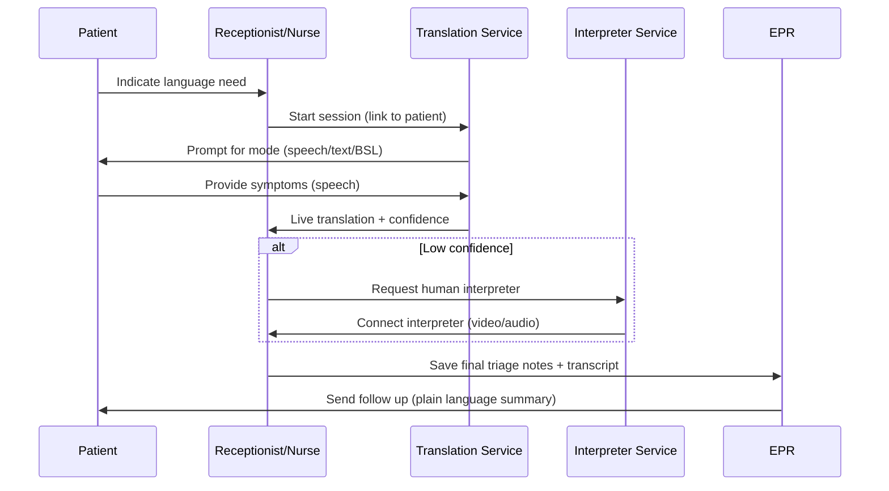
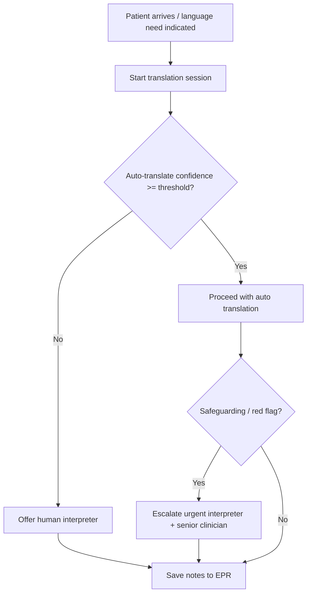

### Journey: A&E Arrival — Immediate Triage & Translation
**Primary Actor:** Patient (non‑English speaker / limited literacy)
**Duration:** 0–2 hours (arrival → triage → disposition)
**Preconditions:**
- Patient arrives at A&E (walk‑in or ambulance)
- Registration desk or waiting area has access to the translation service (device, kiosk, or staff mobile)
- Interpreter preferences (if previously recorded) are available in EPR or patient profile
**Success Criteria:**
- Patient symptoms are accurately captured and triaged within target time
- Clinician receives a reliable translated transcript or live interpretation with confidence score
- Appropriate interpreter escalation occurs when automated translation is insufficient

#### Main Flow
| Step | Actor | Action | System Response | Notes |
|------|-------|--------|-----------------|-------|
| 1 | Patient / Receptionist | Patient indicates language/communication need at check‑in (via kiosk, staff input, or verbally) | System prompts available options: auto‑translate, request human interpreter, BSL video, or family proxy | Capture consent to record translations; pull stored preferences if present |
| 2 | Receptionist / Triage Nurse | Launch translation session on bedside tablet or clinician device; select mode (speech/text/BSL) | Session token created; session linked to patient record; initial language auto‑detected and displayed with confidence | Option to enter clinical category for triage prioritization |
| 3 | Patient & Nurse | Patient describes symptoms (spoken or typed) | Real‑time translation displayed to clinician UI; original audio saved with timestamp; model confidence shown per segment | Low confidence segments highlighted for verifier review |
| 4 | Nurse | Nurse asks clarifying questions; patient responds | System appends Q&A to session transcript; generates concise triage summary and suggested Manchester triage category | Nurse verifies suggested triage level and edits if required |
| 5 | System | If confidence below threshold or flagged keywords (safeguarding, consent, chest pain, stroke) appear, system suggests human interpreter or urgent escalation | Offers to connect remote interpreter (video/audio) or notify on‑site interpreter coordinator | If patient requests BSL, launch BSL video immediately |
| 6 | Nurse | Nurse confirms triage decision and documents outcome | Final translated triage notes saved to EPR; transcript attached; interpreter usage recorded for audit | Time‑to‑triage metric logged |
| 7 | Onward Care | Patient sent to ED bay or discharged per triage | Relevant translated notes follow patient; handover includes confidence flags and whether human interpreter used | Include next steps in plain language for patient and family |

#### Decision Points
- **Decision:** Auto‑translate confidence sufficient?
  - **Yes:** Proceed with auto‑translation; monitor for flagged terms.
  - **No:** Offer immediate connection to human interpreter or schedule interpreter; mark transcript for human verification.
- **Decision:** Is this a safeguarding / red‑flag clinical scenario?
  - **Yes:** Trigger urgent escalation workflow and notify senior clinician + interpreter services.
  - **No:** Continue standard triage flow.
- **Decision:** Does patient require accessibility beyond language (visual/hearing/cognitive)?
  - **Yes:** Switch to accessible mode (read‑aloud, simplified text, BSL) and record preference in patient profile.
  - **No:** Continue with chosen modality.

#### Touchpoints
- Digital: Clinician mobile app / tablet, receptionist kiosk, EPR integration, interpreter video service, SMS/email for patient follow‑up
- Physical: Reception desk, triage room, ED bay, waiting area
- People: Reception staff, triage nurse, ED consultant, interpreter services coordinator, on‑site interpreter (if available), patient’s family/carer

#### Systems & Data Flows
- Auto‑translation engine (on‑prem or cloud) provides live transcripts + per‑segment confidence
- Session manager issues tokens and links transcripts to EPR via secure API
- Interpreter booking system integration (availability, cost estimate, booking confirmation)
- Audit log for all translated communications (to support governance and QA)

#### Pain Points & Opportunities
- Pain: Low confidence translations create clinician uncertainty and slow triage decisions
- Opportunity: Display per‑segment confidence and highlight exact phrases needing human check
- Pain: Booking human interpreters causes delays and administrative overhead
- Opportunity: Integrate availability & cost estimator to recommend in‑house vs remote interpreters
- Pain: Accessibility modes not consistently available on all devices
- Opportunity: Standardise a lightweight accessible UI module for kiosks, mobiles and tablets

#### Metrics & Success Indicators
- Time to triage (target: within local A&E target window)
- Percentage of triage sessions with automated translation accepted (target: ≥80%)
- Rate of escalation to human interpreters and mean wait time for interpreter
- Patient comprehension score (post‑visit SMS survey) and clinician satisfaction
- Translation error sampling rate (audited by quality team)

#### Edge Cases & Error Handling
- Ambulance handover with noisy audio: prefer typed inputs or on‑scene staff to summarize; flag low audio quality and prompt manual entry.
- Multiple languages present (family and patient speak different languages): system supports multi‑party sessions, allows selecting primary language and adding secondary subtitle streams.
- Patient declines recording: system still offers live translation but marks session as non‑recorded and prompts manual note capture.
- Connectivity outage: fall back to queued transcription (capture audio locally and sync when online) and provide telephone interpreter numbers.

---

#### Sequence Diagram: Actor Interactions

#### Process Flow: Decision Logic

