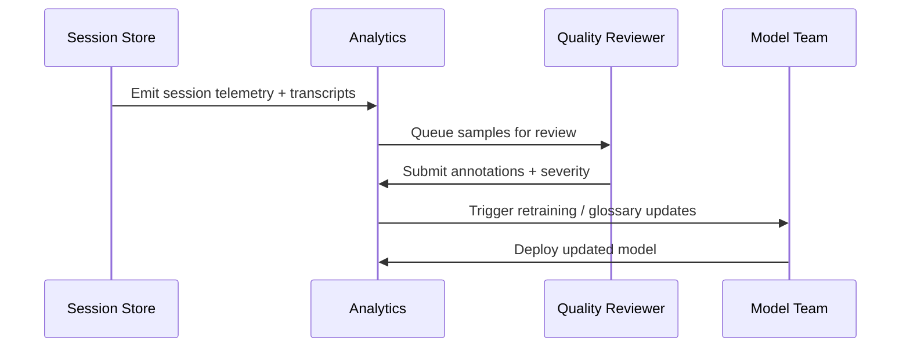
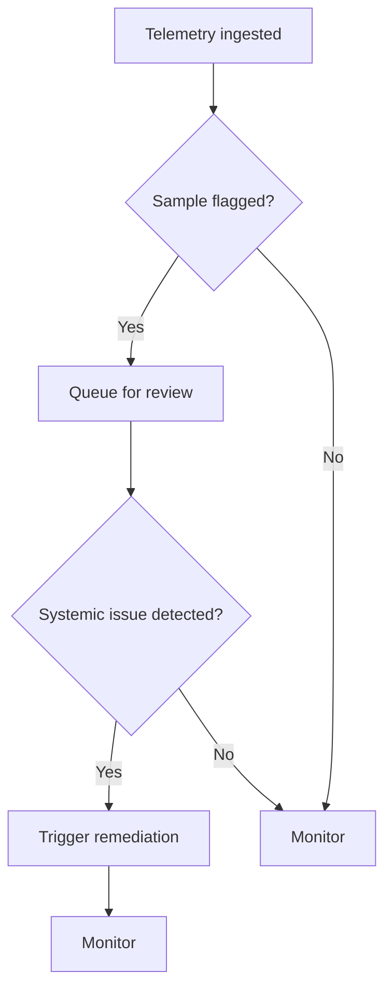

### Journey: Clinical Governance & Quality Monitoring
**Primary Actor:** Lauren Thompson, CIO (and Caroline Ahmed, EDI Manager)
**Duration:** Ongoing (daily dashboards, monthly reports)
**Preconditions:**
- Translation sessions and interpreter usage generate metadata and transcripts
- Quality team and analytics pipelines have access to anonymised samples
**Success Criteria:**
- Regular monitoring of translation quality, usage patterns and costs
- Fast detection of systematic errors and actionable QA loops

#### Main Flow
| Step | Actor | Action | System Response | Notes |
|------|-------|--------|-----------------|-------|
| 1 | System | Ingests session metadata (confidence, duration, flags) into analytics pipeline | Dashboards update in near real‑time showing volumes and quality metrics | Data anonymised for reviewer access unless consented |
| 2 | Quality Lead | Configures sampling rules (random + risk‑based) for transcript review | System queues samples and routes to clinical reviewers or interpreters | Higher weight to low confidence or critical events |
| 3 | Reviewer | Reviews samples, annotates errors and assigns severity | System aggregates annotations and suggests model retraining or policy changes | Feedback loop to engineering and interpreter training teams |
| 4 | Governance Team | Reviews monthly reports on cost, equity, and performance | System produces regulator‑ready reports and logs policy exceptions | Provide EDI metrics by demographic slices to detect disparities |

#### Decision Points
- **Decision:** Does sampling show systemic translation errors in certain language/phrase types?
  - **Yes:** Escalate to remediation (model fine‑tuning, glossary updates, interpreter training).
  - **No:** Continue monitoring.
- **Decision:** Are costs exceeding budget thresholds?
  - **Yes:** Trigger procurement review and adjust in‑house vs vendor mix.
  - **No:** Continue current settings.

#### Touchpoints
- Digital: Quality dashboards, sampling queue, review UI, finance system
- People: Quality reviewers, data scientists, interpreter services, procurement, EDI team

#### Systems & Data Flows
- Analytics pipeline (telemetry ingestion, anonymisation, sample queue)
- Review UI with annotation storage and linkage to sessions
- Model retraining pipeline and glossary management system
- Finance integration for cost reporting and budget alarms

#### Pain Points & Opportunities
- Pain: Lack of labelled data for low‑resource languages for model improvement
- Opportunity: Build labelled corpora via verified human reviews and consented recordings
- Pain: Delays between detection and remediation
- Opportunity: Automate triage of high‑severity errors to priority queues and fast‑track fixes
- Pain: Equity blind spots (demographic data missing)
- Opportunity: Capture EDI attributes (where appropriate) to monitor disparities and inform policy

#### Metrics & Success Indicators
- Translation accuracy by language and domain (sampled audit)
- Time from flagged error to remediation (target: <30 days for high severity)
- Cost per successful session and monthly variance
- EDI metrics: disparity indices across outcomes and comprehension scores

#### Edge Cases & Error Handling
- Privacy/regulatory takedown: remove transcripts on valid requests and notify audit log.
- Biased model behavior discovered: pause auto‑translation for affected languages and route to human interpreters until fixed.

---

#### Sequence Diagram: QA Loop

#### Process Flow: Decision Logic

