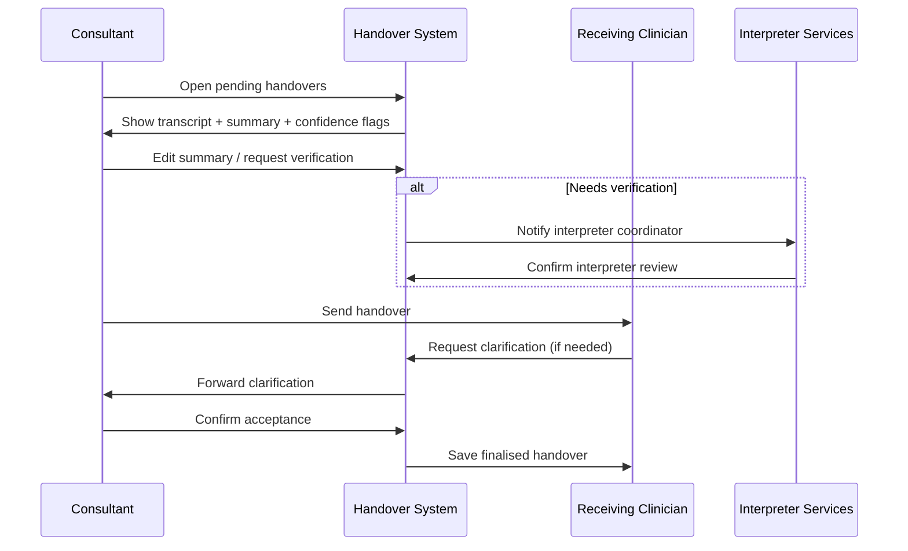
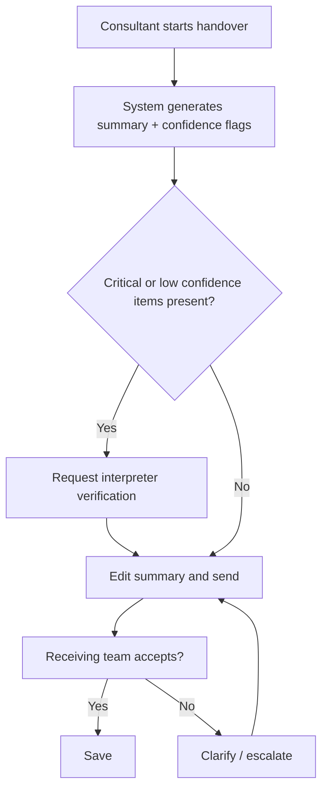

### Journey: Consultant Handover — Structured Handover with Transcripts
**Primary Actor:** Raj Patel, Emergency Consultant
**Duration:** 10–30 minutes (per patient handover)
**Preconditions:**
- Patient has attended A&E and initial triage/assessment completed
- Translation session (if any) is linked to patient record and transcripts are available
- Receiving team (ward or specialty) has access to the EPR and translation transcripts
**Success Criteria:**
- Key clinical information and risks are communicated accurately to receiving team
- Translated transcripts and summaries accompany the handover
- Any low‑confidence translation segments are flagged and resolved prior to handover

#### Main Flow
| Step | Actor | Action | System Response | Notes |
|------|-------|--------|-----------------|-------|
| 1 | Consultant | Opens patient list and selects handover function | System shows pending handovers with language/accessibility flags | Flags show if auto‑translation used and confidence summary |
| 2 | Consultant | Reviews auto‑generated triage and assessment transcript; edits key items (history, meds, allergies, escalation plan) | System offers concise handover summary draft and suggested SAR (situation, assessment, recommendation) format | Suggestions highlight low‑confidence phrases requiring verification |
| 3 | Consultant | Adds verbal handover notes and marks any translation verification done (or requests verification) | System appends consultant comments to transcript and updates status in EPR | If human interpreter needed, system records request and notifies coordinator |
| 4 | Consultant | Sends handover to receiving team (ward registrar / nurse) with translated summary included | Receiving team receives structured document with original quotes, translations and confidence indicators | Option to accept handover or request clarification via chat/video |
| 5 | Receiving Clinician | Reviews handover; if unclear, requests a quick clarifying call or interpreter review | System routes clarification to on‑call consultant and logs response time | If no responder in threshold, escalates to duty consultant |
| 6 | Consultant & Receiving Team | Confirm acceptance of handover and document plan | Finalised handover saved; audit event recorded | Measure handover time and resolution of flagged translations |

#### Decision Points
- **Decision:** Are there low‑confidence or critical phrases in the transcript?
  - **Yes:** Request human verification or attach interpreter note before acceptance.
  - **No:** Proceed with standard handover.
- **Decision:** Is the receiving team satisfied with translated summary?
  - **Yes:** Accept and continue with care plan.
  - **No:** Request immediate clarification (chat/video) or schedule interpreter review.

#### Touchpoints
- Digital: Consultant mobile/desktop handover UI, EPR handover module, secure chat/video for clarifications, interpreter booking system
- Physical: Bedside rounds, ward handover board
- People: Emergency consultant, ward registrar, bed manager, interpreter coordinator, pharmacy for medication queries

#### Systems & Data Flows
- Handover engine pulls structured data (obs, meds, allergies) and appends translation transcripts
- Confidence metadata stored alongside phrases; low‑confidence items can be programmatically flagged
- Secure messaging API for clarifications (option for ephemeral audio snippets with translations)
- Audit logs for medico‑legal compliance; reviewer annotations for QA

#### Pain Points & Opportunities
- Pain: Clinicians may distrust automated summaries without quick verification options
- Opportunity: Allow inline verifier comments that appear in the handover UI with clear status (verified / needs review)
- Pain: Medication names and dosages mistranslated in auto‑translation
- Opportunity: Integrate medication vocabulary lookup and medication‑specific glossary per language to improve accuracy
- Pain: Multiple handovers across teams create fragmentation
- Opportunity: Provide single source of truth handover versioning and clear acceptance workflow

#### Metrics & Success Indicators
- Handover acceptance rate without clarification (target: ≥90%)
- Mean time from handover start to acceptance (target: <15 minutes)
- Percentage of handovers with flagged translation segments and time to resolution
- Clinician satisfaction score for handover quality

#### Edge Cases & Error Handling
- Emergency escalation mid‑handover (patient arrests or rapid deterioration): system marks handover as urgent and pings receiving teams.
- Conflicting human interpreter annotations: provide an arbitration interface for the interpreter coordinator to resolve differences.
- Missing transcript due to prior refusal to record: require manual inline summary and checklists to ensure critical items captured.

---

#### Sequence Diagram: Actor Interactions

#### Process Flow: Decision Logic

