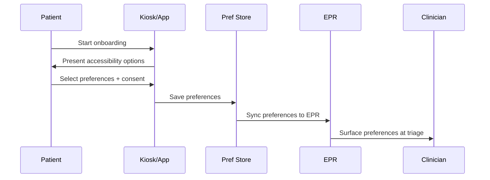
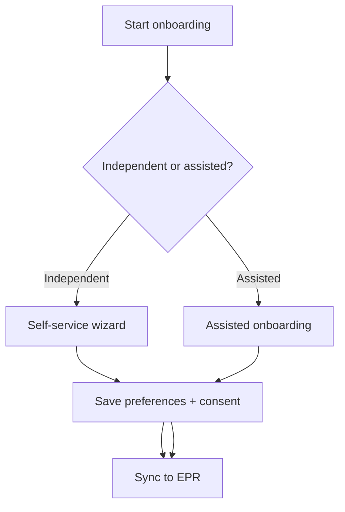

### Journey: Digital Inclusion — Onboarding, Preferences & Proxy Access
**Primary Actor:** Older adult patient (or family proxy)
**Duration:** 10–30 minutes (onboarding) with persistent preferences
**Preconditions:**
- Patient registered with trust or presenting as new to A&E
- Onboarding device or kiosk is available with accessible UI
**Success Criteria:**
- Patient language & accessibility preferences recorded and propagated across systems
- Proxy (family/carer) consent captured where appropriate
- Patient receives content in preferred mode (simplified text, large font, read‑aloud)

#### Main Flow
| Step | Actor | Action | System Response | Notes |
|------|-------|--------|-----------------|-------|
| 1 | Patient / Proxy | Chooses onboarding at kiosk, tablet, or remote link | System runs accessible wizard (language, hearing/vision needs, proxy consent) | Offer multiple modalities (voice, large text, icons) |
| 2 | Patient | Selects preferred language and accessibility options | System saves preferences to patient profile and EPR | Preferences used to pre‑populate session UI and interpreter options |
| 3 | Patient / Proxy | Verifies contact and consent for SMS/email follow‑ups and sharing with proxy | System stores consent with scope and expiry | Provide printable or emailed summary in preferred format |
| 4 | Clinician | Sees persisted preferences at triage or appointment | System surfaces preferences on clinician UI and auto‑selects translation modality | Option to override with patient consent |

#### Decision Points
- **Decision:** Is the patient able to use digital onboarding independently?
  - **Yes:** Proceed with self‑service wizard.
  - **No:** Offer assisted onboarding with staff or proxy; record proxy relationship and consent.
- **Decision:** Does the patient consent to recorded translations and data sharing?
  - **Yes:** Enable recording and sharing for QA and handovers.
  - **No:** Disable recording and provide manual note prompts for clinicians.

#### Touchpoints
- Digital: Onboarding kiosk/tablet, patient portal, SMS/email, clinician UI
- Physical: Reception, assisted kiosks, information desks
- People: Patient, family proxy, reception staff, digital inclusion officer

#### Systems & Data Flows
- Preference store synced to EPR and session manager (language, accessibility flags)
- Consent records with audit trail and expiry management
- Proxy access workflows with secure delegated access tokens

#### Pain Points & Opportunities
- Pain: Inconsistent capture of accessibility needs across departments
- Opportunity: Single preference store with read/write APIs for all front‑line systems
- Pain: Proxy consent complexity and revocation friction
- Opportunity: Simple consent review UI and time‑limited proxy tokens
- Pain: Overly technical language in patient communications
- Opportunity: Provide multiple readability levels and automated plain‑language rewrites

#### Metrics & Success Indicators
- % of patients with recorded language/accessibility preferences
- Time to complete onboarding (target: <15 minutes assisted)
- Proxy consent adoption and error rates
- Patient comprehension score on follow‑up communication

#### Edge Cases & Error Handling
- Patient with fluctuating capacity: support time‑limited proxy and clinical capacity check prompts.
- Conflicting proxy requests: require identity verification and escalation to safeguarding team.
- No device availability: offer paper fallback with staff data entry and later confirmation.

---

#### Sequence Diagram: Onboarding

#### Process Flow: Decision Logic

