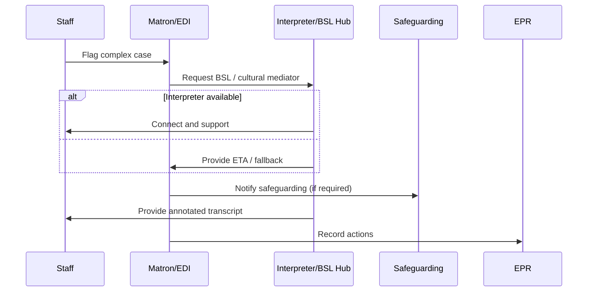
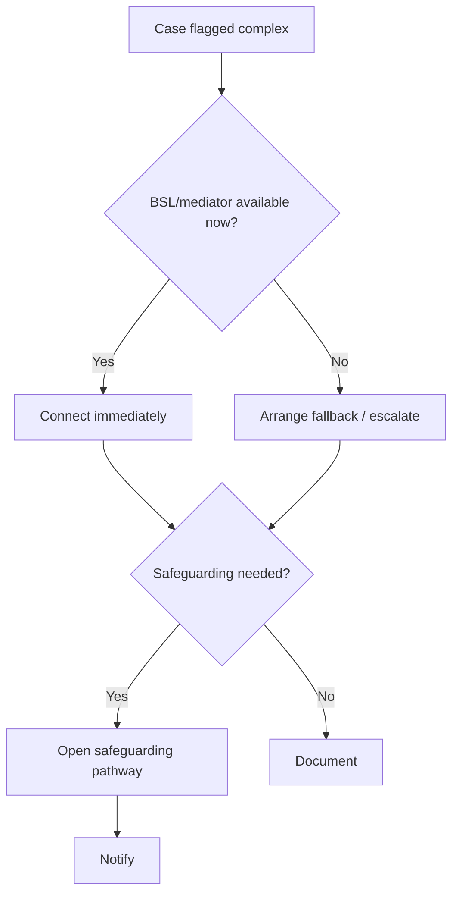

### Journey: Escalation for Complex Cases — BSL & Cultural Mediation
**Primary Actor:** Susan Miller, ED Matron (or EDI Manager)
**Duration:** Hours → days (incident management and follow‑up)
**Preconditions:**
- A case is identified where automated translation is insufficient due to BSL, cultural mediation, safeguarding, or legal complexities
- Interpreter services have BSL and cultural mediation capacities (onsite or remote)
**Success Criteria:**
- Patient receives culturally and linguistically appropriate communication
- Safeguarding and clinical risks are mitigated promptly
- Case notes and decisions are auditable and linked to EPR

#### Main Flow
| Step | Actor | Action | System Response | Notes |
|------|-------|--------|-----------------|-------|
| 1 | Staff | Flag case as complex (BSL, cultural, safeguarding) | System marks session high priority and notifies matron/EDI lead | Include short rationale and required skills |
| 2 | Matron / EDI | Reviews case and authorises interpreter escalation | System triggers BSL video or cultural mediator booking and notifies safeguarding team if needed | Record escalation reason and time |
| 3 | Interpreter / Mediator | Joins session and supports communication, assessment, or safeguarding interview | System records annotated transcript and any interpreter notes | If needed, schedule multi‑party meetings with social care/legal teams |
| 4 | Matron | Oversees follow‑up actions (referrals, safeguarding documentation) | System updates workflows, task lists and notifies relevant teams | Ensure accessible discharge instructions provided |

#### Decision Points
- **Decision:** Is BSL interpreter available immediately?
  - **Yes:** Launch video BSL session and proceed with assessment.
  - **No:** Arrange urgent in‑person or remote cultural mediator and document interim measures.
- **Decision:** Does the case require escalation to safeguarding/legal/social services?
  - **Yes:** Open safeguarding pathway and notify designated officers.
  - **No:** Continue clinical pathway with interpreter support.

#### Touchpoints
- Digital: Urgent notification system, BSL video platform, EPR safeguarding forms, task tracker
- Physical: Private interview rooms, on‑site interpreter arrival
- People: ED matron, interpreter, safeguarding lead, social worker, legal team

#### Systems & Data Flows
- High‑priority flags in session manager trigger multicast notifications
- Secure recording and storage of interpreter annotations, with access controls for safeguarding teams
- Task orchestration system for follow‑up referrals and multi‑agency coordination

#### Pain Points & Opportunities
- Pain: BSL availability is limited, causing delays
- Opportunity: Contract BSL hubs with guaranteed SLA and fallback remote services
- Pain: Sensitive interviews require privacy and specialist skills
- Opportunity: Pre‑position private rooms with video kits and trained staff for rapid response
- Pain: Multi‑agency coordination has paperwork friction
- Opportunity: Standardised digital forms and automated referrals to reduce admin time

#### Metrics & Success Indicators
- Time to BSL/mediator connection (target: as per safeguarding policy)
- Resolution time for safeguarding referrals related to communication barriers
- Patient and family feedback on cultural sensitivity and communication clarity

#### Edge Cases & Error Handling
- Cross‑jurisdictional social care: provide clear ownership steps and escalation contacts.
- Interpreter raises confidentiality concerns: provide secure advisory channel to legal/safeguarding teams.
- Language/dialect unavailable: use cultural mediator to bridge context and note limitations, escalate for specialist translation.

---

#### Sequence Diagram: Escalation Path

#### Process Flow: Decision Logic

