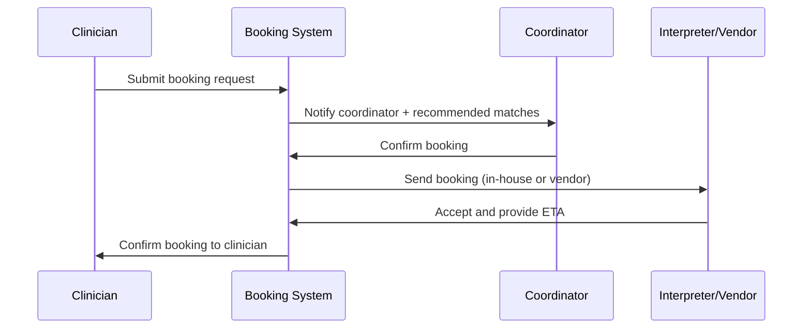
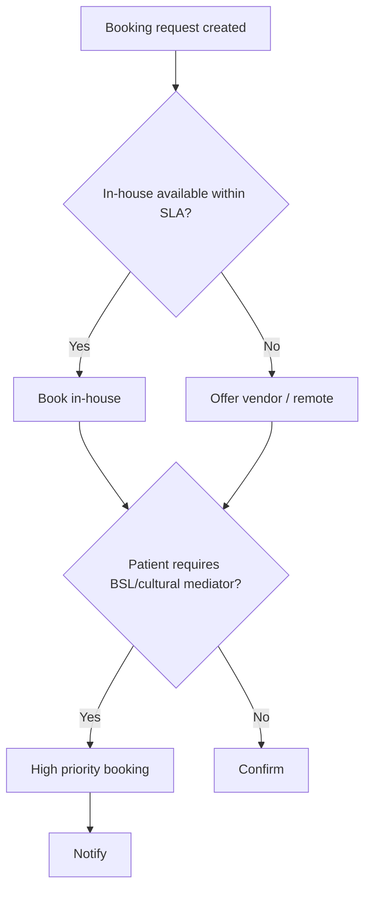

### Journey: Interpreter Booking & Coordination
**Primary Actor:** Daniel Green, Interpreter Services Coordinator
**Duration:** Minutes → hours (booking → confirmation)
**Preconditions:**
- Request for interpreter arises from A&E triage, ward, or remote consultation
- System has access to interpreter rosters, remote vendor APIs, and cost profiles
**Success Criteria:**
- Appropriate interpreter assigned within target SLA
- Booking records include language, modality (in‑person/remote/BSL), cost and confirmation
- Usage and cost data captured for governance

#### Main Flow
| Step | Actor | Action | System Response | Notes |
|------|-------|--------|-----------------|-------|
| 1 | Clinician / Nurse | Requests interpreter via patient session or EPR | Booking UI populates language, urgency, modality options | Pulls patient preferences if present |
| 2 | Coordinator | Views request, checks roster and vendor availability | System recommends best match (in‑house first, then vendor) with ETA and cost estimate | Shows confidence for AI match (certified interpreter vs automated service)
| 3 | Coordinator | Confirms booking (in‑person or remote) | System sends confirmation to interpreter, clinician, and patient (if consented); updates calendar | If remote, starts virtual room link and credentials |
| 4 | Interpreter | Accepts booking and connects at scheduled time | System records start/stop times and collects session metadata (quality, notes) | Option to flag complex cultural mediation needs |
| 5 | Coordinator | Reconciles usage and cost; records outcomes | System posts record to finance and quality dashboards | If no interpreter available, triggers escalation or compensatory workflow |

#### Decision Points
- **Decision:** Is an in‑house interpreter available within SLA?
  - **Yes:** Book in‑house interpreter and prefer on‑site attendance.
  - **No:** Offer remote certified interpreter and provide ETA/cost.
- **Decision:** Does the patient require BSL or cultural mediation?
  - **Yes:** Prioritise BSL certified interpreters or cultural liaison and mark as high priority.
  - **No:** Continue standard booking.

#### Touchpoints
- Digital: Booking UI in EPR, interpreter calendar, remote video platform, SMS/email confirmations
- Physical: In‑person interpreter arrival at ward or A&E bay
- People: Clinician, coordinator, interpreter, patient/family, finance team

#### Systems & Data Flows
- Interpreter roster and vendor APIs (availability, skills, certifications)
- Cost estimator engine (in‑house vs vendor cost comparison)
- Calendar and notification services (email/SMS) and remote video rooms
- Audit trail for bookings, start/stop times, session feedback

#### Pain Points & Opportunities
- Pain: Manual availability checks delay bookings
- Opportunity: Automated match engine prioritising certification and proximity
- Pain: Cost transparency is poor across vendors
- Opportunity: Integrate cost estimator to guide decision and approvals
- Pain: No standard feedback loop for interpreter quality
- Opportunity: Post‑session feedback capture and quality scoring to feed governance

#### Metrics & Success Indicators
- Time to interpreter confirmation (target: <15 minutes for high priority)
- Percentage of bookings served by in‑house interpreters
- Mean cost per interpreter session and monthly spend trends
- Interpreter satisfaction and clinician feedback scores

#### Edge Cases & Error Handling
- Sudden shortage (multiple urgent requests): apply triage rules and redistribute in‑house resources; notify clinical leads.
- Interpreter no‑show: auto‑rebook remote interpreter and escalate to coordinator.
- Multiple languages required simultaneously: spawn multi‑party remote session or sequence interpreters; document choices.

---

#### Sequence Diagram: Booking Flow

#### Process Flow: Decision Logic

